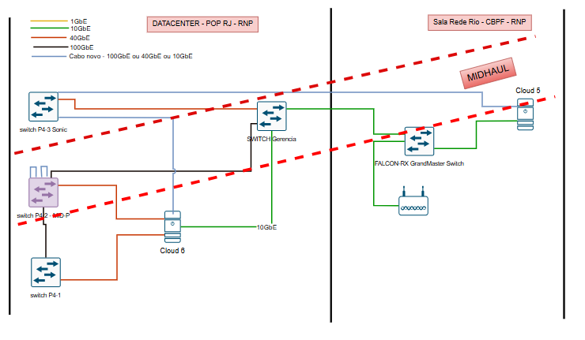
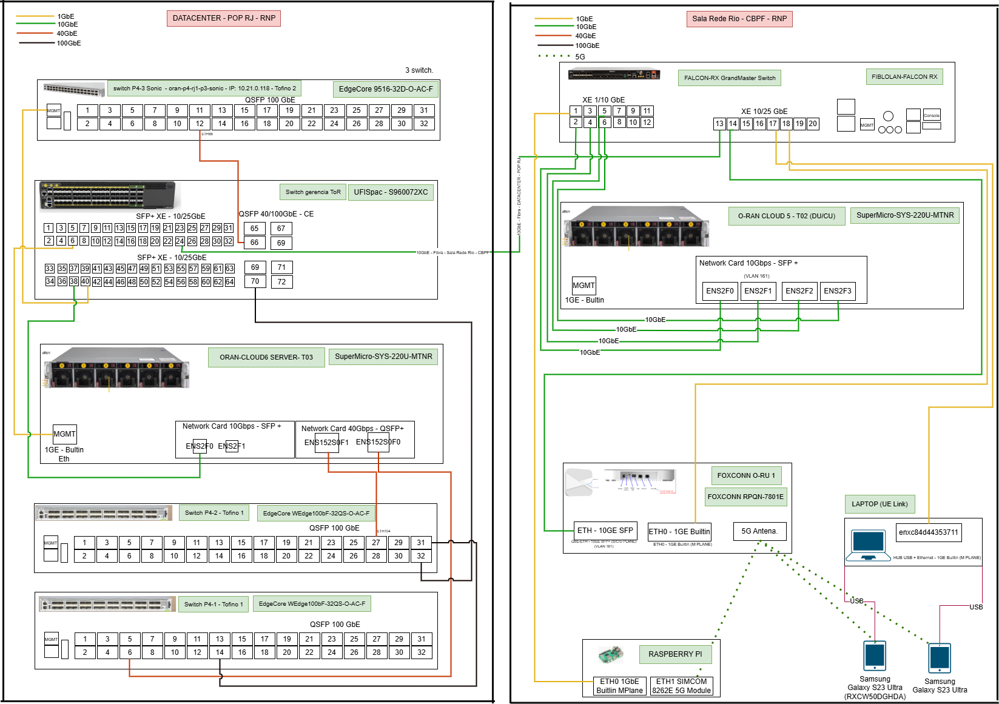
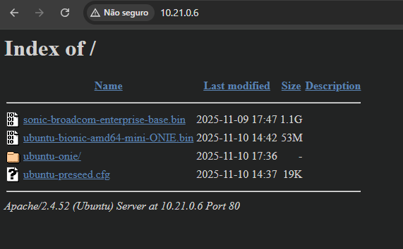
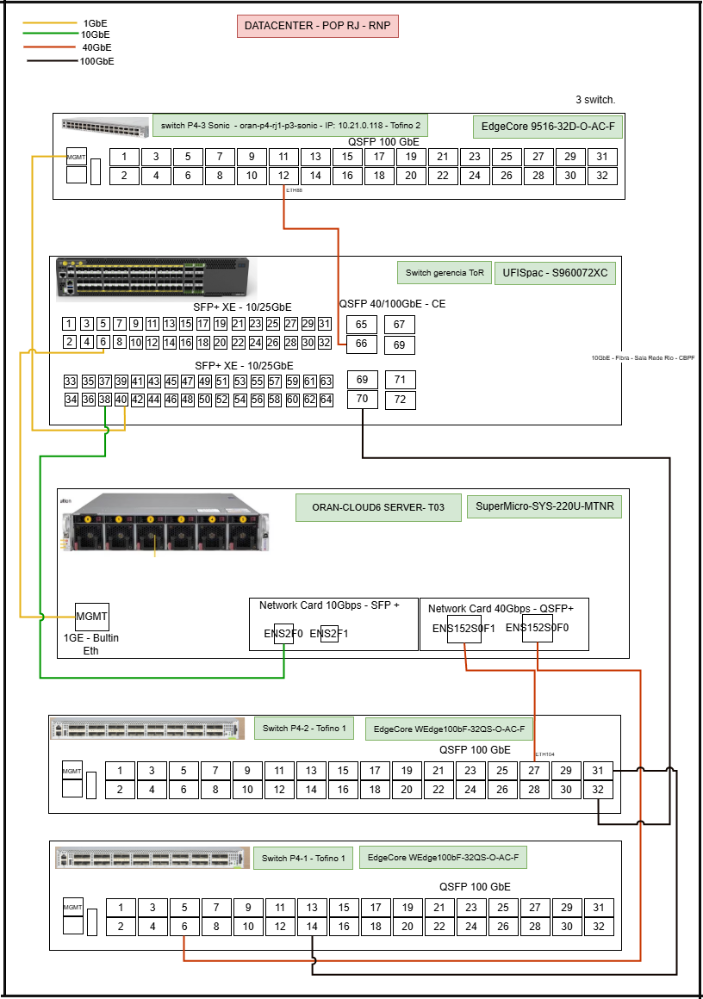

## Programmable MID - Implementation of a programmable dataplane within the OpenRAN Midhaul for implementing routing protocols.


<!--
 https://github.com/luciorp/multi-lora
-->


<p align="justify">
The objective of this work is to set up the programming environment and apply configurations on a Tofino-based switch to process network packets in an Open RAN topology, using protocols that enable network slicing and provide data-plane programmability, and to support the deployment of POLKA. The increasing complexity of 5G networks and future generations demands efficient solutions for traffic management among distributed network elements, particularly within the context
of OpenRAN. Thus, data-plane programmability delivers significant efficiency gains in packet header processing and in routing protocols, enabling more intelligent traffic management across network slices.

Software-Defined Networking (SDN) is a networking paradigm that decouples the network’s decision-making logic (the control plane) from the packet forwarding functions (the data plane). Instead of each switch/router independently running distributed control protocols and making local forwarding decisions, SDN centralizes the control logic in a controller (or a cluster of controllers), which programs the forwarding behavior of the data-plane devices through standardized APIs.


<p align="center">
    <figure>
         
        <figcaption>Figure 1 - Demonstrates the SDN vs Traditional Network.</figcaption>
    </figure>
</p>


## Architecture

<p align="justify">

The image shows two locations interconnected by a high-capacity link labeled “MIDHAUL,” forming a typical topology for a disaggregated and virtualized OPEN RAN deployment:
 - Left — “Datacenter - POP RJ - RNP”: a centralized environment, ideal for hosting virtualized functions such as the vCU and the management/orchestration plane.
 - Right — “Sala Rede Rio - CBPF - RNP”: a site closer to the edge, suitable for the vDU and for connectivity to the RUs (Radio Units), as well as a “GrandMaster” synchronization device.
 - The connectivity arrows and labels (1/10/40/100GbE), along with the presence of programmable (P4) switches, computing clouds (“Cloud 5/6”), and a “GrandMaster Switch,” indicate an architecture aligned with O-RAN principles: disaggregation (RU/DU/CU), virtualization (vDU/vCU), standards-based Ethernet transport with QoS, and precise time synchronization.
</p>

<p align="center">
    <figure>
         
        <figcaption>Figure 2 - Demonstrates the final topology.</figcaption>
    </figure>
</p>

## Prototype

<p align="justify">

#### > I. DATACENTER – POP RJ – RNP

SONiC P4-3 Switch — EdgeCore 9516-32D-O-AC-F (Tofino 2) Type/function: High-performance backbone/aggregation switch, central switching point of the datacenter. Interconnects ToR switches and aggregation switches via 100GbE. Notable connectivity: 100GbE for the ToR Management Switch (UfiSpace S960072XC). 100GbE for Switch P4-2 (Tofino 1) and Switch P4-1 (Tofino 1). Processing resources: Operating system: SONiC (Linux-based). CPU: Embedded x86 multi-core for control plane (typically Intel Atom or Xeon D). Memory: Typically 16 GB to 64 GB (or more) for OS tables and services.

ToR Management Switch — UfiSpace S960072XC Type/function: Top-of-Rack and management switch; aggregates server traffic (10/25/40GbE) and provides 40/100GbE uplinks to the backbone, in addition to the intersite link (10GbE) with the Rio Network Room. Notable connectivity: 100GbE uplink to the SONiC P4-3 Switch. 10/40GbE to the ORAN-CLOUD6 SERVER T03 server. 10GbE to the FALCON-RX GrandMaster Switch (Rio Network Room). Processing resources: Operating system: UfiSpace proprietary OS, SONiC or ONL (varies by load). CPU: embedded multi-core processor (ARM Cortex-A or Intel Atom) for control. Memory: typically 8 GB to 32 GB.

ORAN-CLOUD6 SERVER — T03 — SuperMicro SYS-220U-MTNR Type/Function: High-performance x86 server for O-RAN functions (VNFs, processing, and storage). Notable Connectivity: 10GbE (SFP+) and 40GbE (QSFP+) NICs for the ToR Management Switch. 1GbE for management. Processing Resources: Operating System: Linux (Ubuntu/CentOS/RHEL) or hypervisor (VMware ESXi, Proxmox, OpenStack). CPU: 2× Intel Xeon Scalable (multi-core; dozens of cores combined). Memory: High capacity, typically 128 GB to 1 TB+ (for VNFs and intensive workloads).

Switch P4-2 (Tofino 1) and Switch P4-1 (Tofino 1) — EdgeCore WEdge100bF-32QS-O-AC-F Type/function: High-density 100GbE switches, used for 100G mesh aggregation/expansion. Notable connectivity: 100GbE for the P4-3 SONiC switch. Processing resources: Operating system: SONiC or equivalent open OS. CPU: Embedded x86 multi-core (e.g., Intel Atom/Xeon D) for control plane. Memory: Typically 16 GB to 64 GB. 


#### > II. Rio Network Room – CBPF – RNP

FALCON-RX GrandMaster Switch Type/function: Site access/aggregation switch and likely GrandMaster Clock (precise synchronization for 5G). Concentrates the 10GbE link coming from the data center, connects DU/CU, O-RU, and test devices. Notable connectivity: 10GbE from the ToR Management Switch (Datacenter RJ). 10GbE for O-RAN CLOUD 5 — T02 (DU/CU). 1GbE for FOXCONN O-RU 1, Raspberry Pi, and Laptop (UE Link). Processing capabilities: Operating system: Manufacturer's proprietary OS (carrier/telecom class). CPU: Embedded multi-core processor (ARM Cortex-A or MIPS) for control/timing. Memory: Typically 4 GB to 16 GB.

FIBLOLAN-FALCON RX Type/function: Optical infrastructure/fiber distribution equipment associated with the GrandMaster Switch (supports fiber management and interconnection). Notable connectivity: Management interfaces (MGMT) and optical ports/modules (not detailed). Processing capabilities: Operating system: Embedded RTOS or Linux. CPU: Low-power ARM Cortex-M/A. Memory: Approximately 256 MB to 2 GB.

O-RAN CLOUD 5 — T02 (DU/CU) — SuperMicro SYS-220U-MTNR Type/function: Server hosting DU (real-time baseband) and CU (control plane), core of the 5G O-RAN base station. Notable connectivity: 10GbE (SFP+, VLAN 161) for the FALCON-RX GrandMaster Switch. 1GbE built-in for management via FALCON-RX. Processing resources: Operating system: Real-time optimized Linux (PREEMPT_RT kernel) or RT-tuned hypervisor. CPU: 2× Intel Xeon Scalable (critical for DU processing and CU control). Memory: typically 128 GB to 1 TB+ (signal buffers and VNFs).

FOXCONN O-RU 1 — FOXCONN RPQN-7801E Type/function: 5G Radio Unit (O-RU): converts digital fronthaul ↔ analog RF (to the antenna). Notable connectivity: 10GbE (SFP) to the FALCON-RX GrandMaster Switch (fronthaul to the DU on T02). 1GbE (ETH0) for M-Plane/management/synchronization. RF to the 5G Antenna. Processing resources: Operating system: RTOS or embedded Linux optimized for DSP. CPU: Specialized SoCs (DSPs, FPGAs and/or ARM) for baseband/RF. Memory: Dedicated RAM for signal buffers and firmware (typical of the O-RU class).5G Antenna Type/function: RF antenna that transmits/receives 5G signals to UEs. Notable connectivity: 

Connected via RF to the FOXCONN O-RU 1; Air link with 5G devices (e.g., Galaxy S23 Ultra). Processing capabilities: Typically passive; in active antennas (AAU) there may be processing for beamforming, but here the main processing resides in the O-RU.
Raspberry Pi Type/function: SBC for monitoring/automation/gateway or 5G test device (has 5G SIMCOM 8262E module). Notable connectivity: 1GbE (ETH0) for the FALCON-RX GrandMaster.

</p>

<p align="center">
    <figure>
         
        <figcaption>Figure 3 - Demonstrates the final topology.</figcaption>
    </figure>
</p>


## Main dependencies

## Build and installation - Switch Barefoot Tofino Networks

## Steps 

<ol start="1">
    <li>Create a topology for 5G using a programmable switch.</li>
    <li>Check all operating system and hardware requirements.</li>
    <li>Modify the switch's operating system.</li>
</ol>


#### > Requirements

<ul start="1">
    <li>Access to the serial console and management network.</li>
    <li>Ubuntu OS image compatible with the hardware (.bin file).</li>
    <li>Intel Tofino in DataPlane of the switch.</li>
</ul>

### >> Install Ubuntu Focal.

#### >> Building the Ubuntu ONIE installer

Before building the installer make sure you have wget and xorriso installed on your system. On a Ubuntu based system the following is sufficient:

```bash
build-host:~$ sudo apt update
build-host:~$ sudo apt install xorriso

```

To build the Ubuntu ONIE installer change directories to ubuntu-iso and type the following:


```bash
build-host:~$ cd /ubuntu-iso
build-host:~/ubuntu-iso$ ./cook-bits.sh
Downloading Ubuntu Focal mini.iso ...
...
Saving to: `./input/ubuntu-focal-amd64-mini.iso'

100%[==================================================================================================>] 29,360,128  3.11M/s   in 8.6s    

2015-10-09 10:15:12 (3.25 MB/s) - `./input/ubuntu-focal-amd64-mini.iso' saved [29360128/29360128]

Creating ./output/ubuntu-focal-amd64-mini-ONIE.bin: .xorriso 1.2.2 : RockRidge filesystem manipulator, libburnia project.

xorriso : NOTE : Loading ISO image tree from LBA 0
xorriso : UPDATE : 280 nodes read in 1 seconds
xorriso : NOTE : Detected El-Torito boot information which currently is set to be discarded
Drive current: -indev './input/ubuntu-focal-amd64-mini.iso'
Media current: stdio file, overwriteable
Media status : is written , is appendable
Boot record  : El Torito , ISOLINUX boot image capable of isohybrid
Media summary: 1 session, 11098 data blocks, 21.7m data, 1210g free
Volume id    : 'ISOIMAGE'
Copying of file objects from ISO image to disk filesystem is: Enabled
xorriso : UPDATE : 280 files restored ( 21495k) in 1 seconds = 15.9xD
..... Done.
```


The resulting ONIE installer file is available in the output directory:

```bash
build-host:~/ubuntu-iso$ ls -l output/
total 17812
-rw-r--r-- 1 user user 18238940 Oct  9 10:15 ubuntu-focal-amd64-mini-ONIE.bin
```


#### > Method A: Installation via USB

Prepare the USB flash drive

<ul>
    <li>Format to FAT32</li>
    <li>Copy the files below to the root of the USB drive</li>
    <li>Connect the USB drive to the USB port on the switch. </li>
</ul>

Files:

```bash
ubuntu-focal-amd64-mini-ONIE.bin
ubuntu-preseed.cfg
```

Remove the current operating system.
<ul>
    <li>Reboot Switch → ONIE Menu → ONIE: Uninstall OS → Reboot</li>
</ul>


Install Ubuntu
<ul>
    <li>Reboot Switch → ONIE Menu → ONIE: Install OS → Reboot</li>
</ul>


#### > Method B: Installation via HTTP Server

Disponibilizar os Arquivos no Servidor Apache/HTTP

<ul>
    <li>Place the files in the directory published by HTTP -- http://10.0.0.200/ubuntu-focal-amd64-mini-ONIE.bin -- </li>
</ul>

Files:

```bash
ubuntu-focal-amd64-mini-ONIE.bin
ubuntu-preseed.cfg
```

<p align="center">
    <figure>
         
        <figcaption>Figure 4 - HTTP Server.</figcaption>
    </figure>
</p>


Remove the current operating system.
<ul>
    <li>Reboot Switch → ONIE Menu → ONIE: Uninstall OS → Reboot</li>
</ul>


Install Ubuntu
<ul>
    <li>Reboot Switch → ONIE Menu → ONIE: Install OS → Reboot</li>
</ul>


Enter ONIE Rescue mode (if necessary)

```bash
onie-stop
```

Configure the Network Manually:

```bash
ifconfig eth0 10.x.x.x netmask 255.255.255.0
ip route add default via 10.x.x.254
```
   
Command to install Ubuntu:

```bash
onie-nos-install http://10.21.0.6/ubuntu-focal-amd64-mini-ONIE.bin
```


### >> Install SONIC.

Basically, you just need to download it via HTTP.

```bash
onie-nos-install http://10.21.0.6/sonic-broadcom-enterprise-base.bin
```

```bash
Debian GNU/Linux 9 sonic ttyS1

sonic login: admin
Password: YourPaSsWoRd
```

For the message "Zero Touch Provisioning discovery in progress. Please disable ZTP or logout." uses the command: 

Too, install apps for network diagnostic.

```bash
sudo ztp disable
yes
```

[Install process](https://github.com/PedroEduardo68/DSOCMU_PMID/blob/main/Install-processo.md)


```bash
apt-get install nano htop mtr telnet
```


Then, stop all containers to start a new container with the compiler.

```bash
docker ps

docker stop [ID CONTAINER]
docker system prune -af
``` 


```bash
docker build -t sdep4 .
docker run -it sdep4 /bin/bash

``` 


```bash
docker run --rm alpine ping -c 3 8.8.8.8
docker run --rm alpine wget -qO- http://google.com
``` 


Switch information from ONIE after uploading SONIC.

```bash
cat machine.conf
onie_arch=x86_64
onie_bin=
onie_boot_fs_type=ext4
onie_boot_gfdisk_type=0x3000
onie_boot_gpt_uuid= #####
onie_boot_label=ONIE-BOOT
onie_boot_mnt=/mnt/onie-boot
onie_boot_reason=install
onie_build_date=2019-07-24T13:52+0800
onie_build_machine=accton_as9516_32d
onie_build_platform=x86_64-accton_as9516_32d-r0
onie_cli_static_parms=
onie_cli_static_url=http://10.21.0.6/sonic-broadcom-enterprise-base.bin
onie_config_dir=/mnt/onie-boot/onie/config
onie_config_version=1
onie_default_filename=onie-installer-x86_64-accton_as9516_32d-r0
onie_default_filenames=onie-installer-x86_64-accton_as9516_32d-r0
onie_dev=/dev/sda2
onie_exec_url=http://10.21.0.6/sonic-broadcom-enterprise-base.bin
onie_firmware=auto
onie_grub_image_name=grubx64.efi
onie_iana_enterprise=42623
onie_image_suffixes=.bin
onie_image_type_nos=nos
onie_image_type_update=update
onie_initrd_tmp=/
onie_installer=/var/tmp/installer
onie_kernel_version=4.9.95
onie_machine=accton_as9516_32d
onie_machine_rev=0
onie_operation=os-install
onie_partition_type=gpt
onie_platform=x86_64-accton_as9516_32d-r0
onie_root_dir=/mnt/onie-boot/onie
onie_server_name=onie-server
onie_skip_ethmgmt_macs=no
onie_switch_asic=bfn
onie_uefi_arch=x64
onie_uefi_boot_loader=grubx64.efi
onie_update_attempts_dir=/mnt/onie-boot/onie/update/attempts
onie_update_dir=/mnt/onie-boot/onie/update
onie_update_log=/mnt/onie-boot/onie/update/update.log
onie_update_pending_dir=/mnt/onie-boot/onie/update/pending
onie_update_results_dir=/mnt/onie-boot/onie/update/results
onie_updater_cookie=ONIE-UPDATER-COOKIE
onie_vendor_id=259
onie_version=2019.05.00.04
```


## First steps Simulation

#### > Error during explanation and the reason.

During the installation of Ubuntu Focal, the process did not complete successfully. A compatibility issue related to the disk and hardware occurred. Even after the Ubuntu image was installed and the verification (check) was completed, the operating system would not boot  only SONiC Broadcom was loaded. Consequently, SONiC was reinstalled using the image downloaded from www.edge-core.com, following a support ticket with the SONiC team.

Image name: sonic-broadcom-enterprise-base.bin.


Below is the Switch information for requesting the firmware.

```bash
Platform  : x86_64-accton_as9516_32d-r0
Version   : 2019.05.00.04
Build Date: 2019-07-24T13:52+0800
fpga version 00/00/ 0 00:00:00bf_fpga probe ok
ata1.00: failed to set xfermode (err_mask=0x40)
Info: Mounting kernel filesystems... done.
Info: Mounting ONIE-BOOT on /mnt/onie-boot ...
ERROR: fsck corrected errors.
Info: Mounting EFI System on /boot/efi ...
Info: BIOS mode: UEFI
Running Accton AS9516_32D
```


```bash
ONIE:/ #  cat /etc/machine.conf
onie_version=2019.05.00.04
onie_vendor_id=259
onie_build_machine=accton_as9516_32d
onie_machine_rev=0
onie_arch=x86_64
onie_build_platform=x86_64-accton_as9516_32d-r0
onie_config_version=1
onie_build_date="2019-07-24T13:52+0800"
onie_partition_type=gpt
onie_kernel_version=4.9.95
onie_firmware=auto
onie_switch_asic=bfn
onie_skip_ethmgmt_macs=no
onie_grub_image_name=grubx64.efi
onie_uefi_boot_loader=grubx64.efi
onie_uefi_arch=x64
onie_machine=accton_as9516_32d
onie_platform=x86_64-accton_as9516_32d-r0
```


<!--


1 - You need to get the following packages to compile prototype bare-metal firmware using ESP-IDF. 

```
sudo apt-get install git wget flex bison gperf python3 python3-pip python3-setuptools cmake ninja-build ccache libffi-dev libssl-dev dfu-util libusb-1.0-0
```

2 - You need the software libraries provided by Espressif in the ESP-IDF repository to build applications for the prototype.  To get ESP-IDF, navigate to your installation directory and clone the repository with git clone, following instructions.

Open Terminal and run the following commands:
```
mkdir -p ~/esp
cd ~/esp
git clone --recursive https://github.com/espressif/esp-idf.git
```
3 - You also need to install the tools used by ESP-IDF for projects supporting ESP32, such as the compiler, debugger, Python packages, etc.
```
cd ~/esp/esp-idf
./install.sh esp32
```

4 - The installed tools are not added to the PATH environment variable yet. You must set some environment variables to make the tools usable from the command line. ESP-IDF provides a script that does that.

In the terminal where you are going to use ESP-IDF, run:
```
. $HOME/esp/esp-idf/export.sh
```
5 - Now, you are ready to prepare your application for the prototype. You can start cloning the project.
```
  git clone https://github.com/luciorp/multi-lora.git
  
  cd multi-lora
```
6 - Build the project by running:

```
idf.py build
```
This command compiles the application and all ESP-IDF components and generates the bootloader, partition table, and application binaries.
```
$ idf.py build
Running cmake in directory /path/to/multi-lora/build
Executing "cmake -G Ninja --warn-uninitialized /path/to/multi-lora"...
Warn about uninitialized values.
-- Found Git: /usr/bin/git (found version "2.17.0")
-- Building empty aws_iot component due to configuration
-- Component names: ...
-- Component paths: ...

... (more lines of build system output)

[527/527] Generating multi-lora.bin
esptool.py v2.3.1

Project build complete. To flash, run this command:
../../../components/esptool_py/esptool/esptool.py -p (PORT) -b 921600 write_flash --flash_mode dio --flash_size detect --flash_freq 40m 0x10000 build/multi-lora.bin  build 0x1000 build/bootloader/bootloader.bin 0x8000 build/partition_table/partition-table.bin
or run 'idf.py -p PORT flash'
```

6 - Flash the binaries that you just built (bootloader.bin, partition-table.bin, and multi-lora.bin) onto your prototype board by running:

```
idf.py -p PORT [-b BAUD] flash
```
Replace PORT with your ESP32 board’s serial port name.

### How to test

You will see the output log similar when flashing firmware in the prototype:
```
esptool.py --chip esp32 -p /dev/ttyUSB0 -b 460800 --before=default_reset --after=hard_reset write_flash --flash_mode dio --flash_freq 40m --flash_size 2MB 0x8000 partition_table/partition-table.bin 0x1000 bootloader/bootloader.bin 0x10000 hello_world.bin
esptool.py v3.0-dev
Serial port /dev/ttyUSB0
Connecting........_
Chip is ESP32D0WDQ6 (revision 0)
Features: WiFi, BT, Dual Core, Coding Scheme None
Crystal is 40MHz
MAC: 24:0a:c4:15:b7:18
Uploading stub...
Running stub...
Stub running...
Changing baud rate to 460800
Changed.
Configuring flash size...
Compressed 3072 bytes to 103...
Writing at 0x00008000... (100 %)
Wrote 3072 bytes (103 compressed) at 0x00008000 in 0.0 seconds (effective 5962.8 kbit/s)...
Hash of data verified.
Compressed 26096 bytes to 15408...
Writing at 0x00001000... (100 %)
Wrote 26096 bytes (15408 compressed) at 0x00001000 in 0.4 seconds (effective 546.7 kbit/s)...
Hash of data verified.
Compressed 147104 bytes to 77364...
Writing at 0x00010000... (20 %)
Writing at 0x00014000... (40 %)
Writing at 0x00018000... (60 %)
Writing at 0x0001c000... (80 %)
Writing at 0x00020000... (100 %)
Wrote 147104 bytes (77364 compressed) at 0x00010000 in 1.9 seconds (effective 615.5 kbit/s)...
Hash of data verified.

Leaving...
Hard resetting via RTS pin...
Done
```
<p align="justify">
To check if Multi-LoRa firmware is indeed running, type idf.py -p PORT monitor (replace PORT with your serial port name).
The firmware's default configuration generates random traffic to all nodes in the routing table. 
</p>
<p align="center">
     
</p>


## First steps Simulation

You need to install some software packages on Debian Linux to use the simulator, such as make, gcc, and python 3 with their libraries.

### Build and installation

Install the gcc compiler and make to compile firmware on x86_64 architecture and make simulation possible.
```
sudo apt-get -y install make build-essential
```
Install the python interpreter to run the mesh network simulator.
```
sudo apt install -y python3 python3-pip libssl-dev libffi-dev python3-dev python3-venv
```
Now, you are ready to prepare your emulation/simulation. You can start the clone of the project.
```
  git clone https://github.com/luciorp/multi-lora.git
  
  cd multi-lora/simulator
```
Build the firmware to emulate on x86_64 architecture by running make all inside the folder multi-lora/simulator/mac_sim

Back to the multi-lora/simulator/ folder and install the necessary libraries to run the python simulator
```
pip3 install -r requirements.txt
```
### How to test

You need to configure the topology.csv file with the distribution of nodes in space to run the python simulator.

```
NodeId,Xcoord,Ycoord,Address
nodeA,   0,     0,    10
nodeB,   0,     4,    20
nodeC,   0,     8,    30
nodeD,   4,     0,    40
nodeE,   4,     4,    50
nodeF,   4,     8,    60
nodeG,   8,     0,    70
nodeH,   8,     4,    80
nodeI,   8,     8,    90
```

Configure the packets.csv file to indicate the packets to be sent with the source node address, destination node address, payload (hexadecimal), 
and the time in ms.

```
pktID, srcAddre, destAddr, startTime, dataPayload
  1,      10,       90,        10,        AABBCCDDEEFF112233445566778899
  2,      10,       80,        3000,      AABBCCDDEEFF112233
  3,      10,       50,        6000,      AABBCCDDEEFF112233445566778899ABCDEFABCDEF

```
<p align="justify">

</p>
Start simulation.

```
python3 simulator.py
```

The results are listed in the results.csv file at the end of the simulation process.

```
pktID, srcAddre, destAddr, totalTime, timeout, dataError
  1,      10,       90,        63,       0,      0
  2,      10,       80,        42,       0,      0
  3,      10,       50,        87,       0,      0

```

## Main results

<p align="justify">

</p>

<p align="justify">


<p align="center">
     
</p>
    
<p align="justify">

</p>

<p align="center">
     
</p>


 

 -->


## Reference of the de procediment

```bash
@misc{cern_bfsde_installation,
  title        = {BF SDE Installation},
  howpublished = {CERN Twiki},
  url          = {https://twiki.cern.ch/twiki/bin/view/Main/Bfsde_installation},
  note         = {Documento online}
}
```


```bash
@misc{eversonscherrer_ubuntu_onie,
  author       = {Scherrer, Everson},
  title        = {ubuntu-onie},
  howpublished = {GitHub},
  url          = {https://github.com/eversonscherrer/ubuntu-onie},
  note         = {Repositório de código}
}
```

```bash
@misc{wililupy_ubuntu_onie,
  author       = {Wililupy},
  title        = {ubuntu-onie},
  howpublished = {GitHub},
  url          = {https://github.com/wililupy/ubuntu-onie},
  note         = {Repositório de código}
}
```

```bash
@misc{mariusz_stordis_ubuntu_onie,
  author       = {Stordis, Mariusz},
  title        = {ubuntu-onie: Working with UEFI and add Onie boot option},
  howpublished = {GitHub},
  url          = {https://github.com/mariusz-stordis/ubuntu-onie},
  note         = {Repositório de código}
}
```

```bash
@misc{geant_gp4l_home,
  title        = {GP4L Home},
  howpublished = {GEANT Wiki},
  url          = {https://wiki.geant.org/spaces/GP4L/pages/361365655/Home},
  note         = {Página wiki}
}
```
```bash
@misc{youtube_vNfMWjSmgfg,
  title        = {Instalação — Vídeo 1},
  howpublished = {YouTube},
  url          = {https://www.youtube.com/watch?v=vNfMWjSmgfg},
  note         = {Vídeo online}
}
```
```bash
@misc{youtube_oRn9Bb3AsVs,
  title        = {Instalação — Vídeo 2},
  howpublished = {YouTube},
  url          = {https://www.youtube.com/watch?v=oRn9Bb3AsVs},
  note         = {Vídeo online}
}
```
```bash
@misc{youtube_Zakdfj3U2yg,
  title        = {Instalação — Vídeo 3},
  howpublished = {YouTube},
  url          = {https://www.youtube.com/watch?v=Zakdfj3U2yg},
  note         = {Vídeo online}
}
```


## How to cite 
```bash
@article{PROGRAMMABLEMID,
    author = {Pedro Eduarod Camera and Cristiano Bonato Both},
    title = {Programmable MID - Implementation of a programmable dataplane within the OpenRAN Midhaul for implementing routing protocols}.
}
```